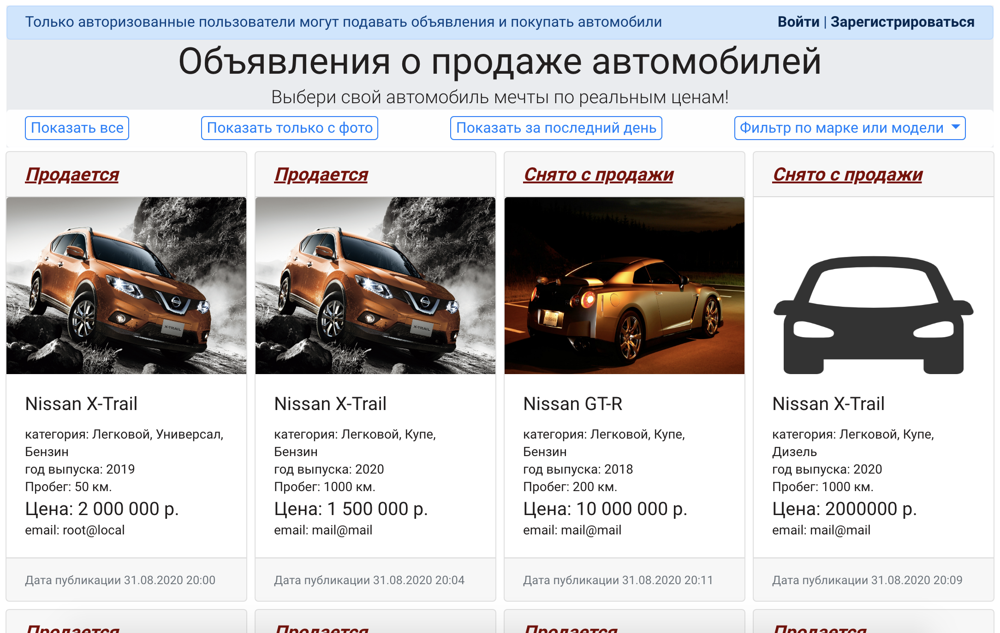
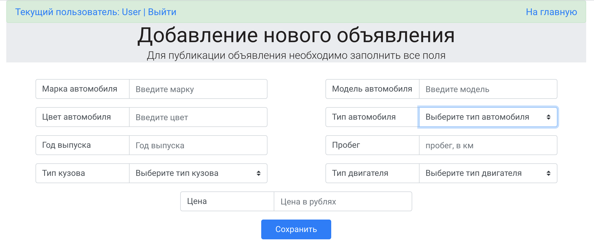
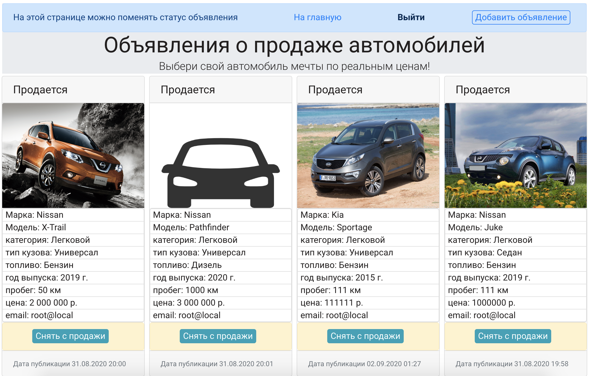
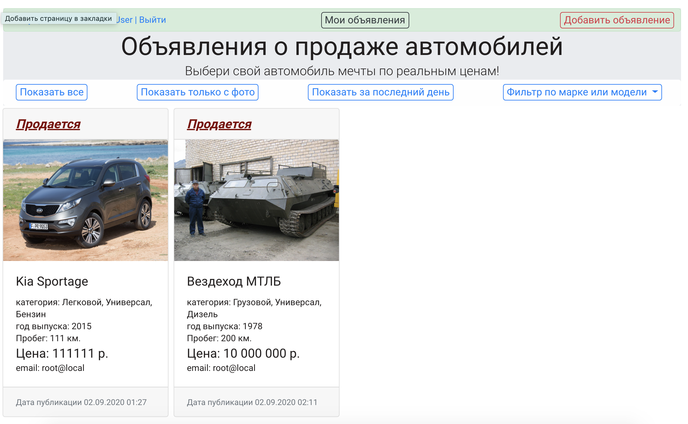

# WEB-приложение по продаже автомобилей
При создании приложения использованы технологии:
 * HTML5, CSS3 + flexbox, JQuery
 * VCS Git
 * Java 14
 * Apache Maven
 * Apache Tomcat 9
 * Servlet Api, JSTL
 * PostgreSQL
 * JPA, Hibernate
 * Travis-ci

 
 Стартовая страница

Для работы с приложением(подавать объявления, менять статус, пользоваться 
фильтрами) необходимо авторизоваться (зарегистрироваться)
 
 Страница добавления нового объявления
 

 В личном кабинете пользователе доступно изменение статуса и полная информация
 по опубликованным им объявлениям
 
 
 Пример работы фильтра "Показать за последний день"
 
 